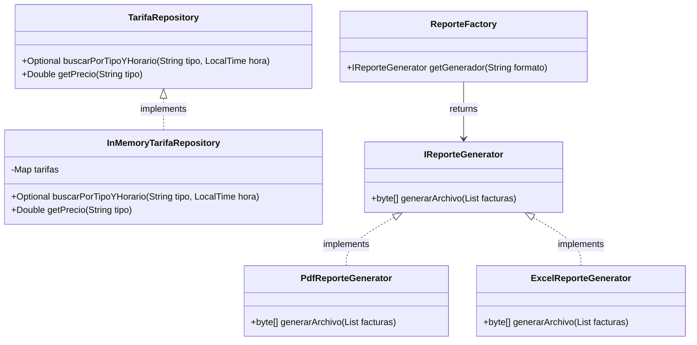
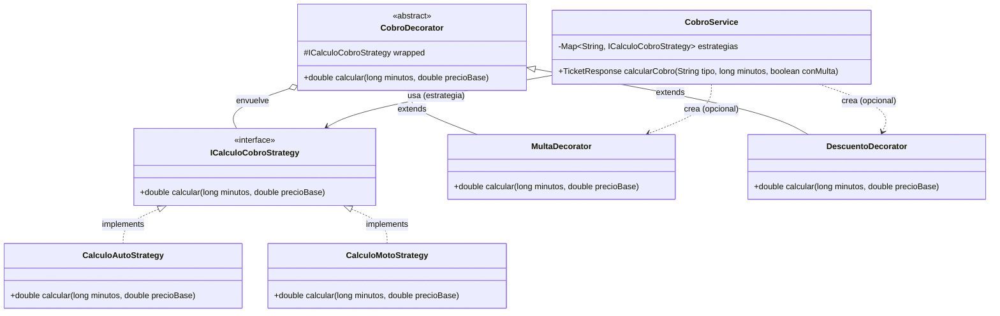

# 📚 DOCUMENTACIÓN - MÓDULO FINANCIERO (TARIFAS Y COBROS)

**Autor:** Alfredo (Módulo Financiero)  
**Fecha:** Diciembre 2025  
**Tecnología:** Spring Boot 3.2.0 + Java 17

---

## 📖 ÍNDICE

1. [Resumen Ejecutivo](#resumen)
2. [Arquitectura](#arquitectura)
3. [Patrones de Diseño](#patrones)
4. [Componentes Implementados](#componentes)
5. [Endpoints REST](#endpoints)
6. [Sistema de Reportes](#sistema-reportes)
7. [Validaciones](#validaciones)
8. [Instalación y Uso](#instalacion)

---

## 1. RESUMEN EJECUTIVO <a id="resumen"></a>

### 1.1 Alcance del Módulo

Este módulo implementa la funcionalidad completa de:
- ✅ Gestión de Tarifas por tipo de vehículo
- ✅ Cálculo de Cobros con lógica dinámica
- ✅ Sistema de Decoradores para Multas y Descuentos
- ✅ Emisión de Facturas Electrónicas (Simulación)
- ✅ Generación de Reportes Financieros (PDF/Excel)

### 1.2 Métricas del Proyecto

| Métrica | Cantidad |
|---------|----------|
| **Endpoints REST** | 8 |
| **Modelos** | 2 |
| **DTOs** | 4 |
| **Services** | 5 |
| **Controllers** | 2 |
| **Strategies/Decorators** | 6 |
| **Patrones de Diseño** | 5 |

---

## 2. ARQUITECTURA <a id="arquitectura"></a>

### 2.1 Arquitectura en Capas

```
┌─────────────────────────────────────┐
│         CAPA PRESENTACIÓN           │
│   (Controllers - REST API)          │
├─────────────────────────────────────┤
│         CAPA APLICACIÓN             │
│   (DTOs)                            │
├─────────────────────────────────────┤
│         CAPA NEGOCIO                │
│   (Services + Decorators)           │
├─────────────────────────────────────┤
│         CAPA DOMINIO                │
│   (Models + Strategies)             │
├─────────────────────────────────────┤
│         CAPA PERSISTENCIA           │
│   (Repositories)                    │
└─────────────────────────────────────┘
```

### 2.2 Estructura de Paquetes

```
com.parking.system/
├── controller/
│   ├── CobroController.java
│   └── TarifaController.java
├── service/
│   ├── CobroService.java
│   ├── report/
│   │   ├── ReporteFactory.java
│   │   ├── IReporteGenerator.java
│   │   ├── PdfReporteGenerator.java
│   │   └── ExcelReporteGenerator.java
│   └── strategies/
│       ├── ICalculoCobroStrategy.java
│       ├── CalculoAutoStrategy.java
│       ├── CalculoMotoStrategy.java
│       ├── CobroDecorator.java
│       ├── MultaDecorator.java
│       └── DescuentoDecorator.java
├── model/
│   ├── Factura.java
│   └── Tarifa.java
├── dto/
│   ├── CobroRequest.java
│   ├── CobroRequestDTO.java
│   ├── FacturaResponse.java
│   └── TicketResponse.java
└── repository/
    └── TarifaRepository.java
```

---

## 2.3 Diagramas UML

### Diagrama General: Visión Completa del Módulo (UML de Clases)

Este diagrama muestra las principales clases, interfaces, abstracciones y repositorios del módulo de cobro.

```mermaid
classDiagram
    %% --- Clases del Módulo AlfredoModuloCode ---

    %% Controllers
    class CobroController {
        -CobroService cobroService
        +CobroController(CobroService)
        +calcularCobro(CobroRequest): TicketResponse
        +procesarPago(CobroRequest): FacturaResponse
        +generarReporte(String): ResponseEntity
        +obtenerTodasFacturas(): ResponseEntity
        +obtenerFacturaPorId(Long): ResponseEntity
    }

    class TarifaController {
        -TarifaRepository tarifaRepository
        +listarTarifas(): List~Tarifa~
        +crearTarifa(Tarifa): Tarifa
        +eliminarTarifa(Long): void
    }

    %% Services
    class CobroService {
        -TarifaRepository tarifaRepository
        -Map~String, ICalculoCobroStrategy~ estrategias
        -ReporteFactory reporteFactory
        -List~Factura~ facturasRealizadas
        +CobroService(TarifaRepository, Map, ReporteFactory)
        +calcularCobro(String, long, boolean): TicketResponse
        +emitirFactura(String, double): Factura
        +generarReporte(String): byte[]
        +obtenerTodasFacturas(): List~Factura~
    }

    %% Strategies
    class ICalculoCobroStrategy {
        <<interface>>
        +calcular(long, double): double
    }

    class CalculoAutoStrategy {
        +calcular(long, double): double
    }

    class CalculoMotoStrategy {
        +calcular(long, double): double
    }

    class CobroDecorator {
        <<abstract>>
        #ICalculoCobroStrategy cobroEnvuelto
        +CobroDecorator(ICalculoCobroStrategy)
        +calcular(long, double): double
    }

    class MultaDecorator {
        +calcular(long, double): double
    }

    class DescuentoDecorator {
        +calcular(long, double): double
    }

    %% Factory & Reports
    class ReporteFactory {
        +getGenerador(String): IReporteGenerator
    }

    class IReporteGenerator {
        <<interface>>
        +generarArchivo(List~Factura~): byte[]
    }

    class PdfReporteGenerator {
        +generarArchivo(List~Factura~): byte[]
    }

    class ExcelReporteGenerator {
        +generarArchivo(List~Factura~): byte[]
    }

    %% Repository
    class TarifaRepository {
        <<interface>>
        +buscarPorTipoYHorario(String, LocalTime): Optional~Tarifa~
    }

    class InMemoryTarifaRepository {
        +buscarPorTipoYHorario(String, LocalTime): Optional~Tarifa~
    }

    %% Models
    class Factura {
        -Long id
        -String nitCliente
        -Double montoTotal
        -LocalDateTime fechaEmision
    }

    class Tarifa {
        -Long id
        -Double precioUnitario
        -String tipoVehiculo
    }

    %% --- Relaciones ---

    %% Dependency / Association
    CobroController --> CobroService : usa
    CobroService --> TarifaRepository : usa
    CobroService --> ReporteFactory : usa
    CobroService --> ICalculoCobroStrategy : usa (Map)
    CobroService "1" *-- "*" Factura : composition (in-memory list)

    TarifaController --> TarifaRepository : usa

    %% Realization (Implementation)
    CalculoAutoStrategy ..|> ICalculoCobroStrategy
    CalculoMotoStrategy ..|> ICalculoCobroStrategy
    CobroDecorator ..|> ICalculoCobroStrategy
    InMemoryTarifaRepository ..|> TarifaRepository

    PdfReporteGenerator ..|> IReporteGenerator
    ExcelReporteGenerator ..|> IReporteGenerator

    %% Inheritance (Extension)
    MultaDecorator --|> CobroDecorator
    DescuentoDecorator --|> CobroDecorator

    %% Aggregation
    CobroDecorator o-- ICalculoCobroStrategy : envuelve

    %% Factory Creation
    ReporteFactory ..> IReporteGenerator : crea

```



---

### Diagrama 1: Patrones Factory y Repository.




---

### Diagrama 2: Patrones Strategy y Decorator



---
## 3. PATRONES DE DISEÑO <a id="patrones"></a>

### 3.1 Strategy Pattern ⭐

**Propósito:** Calcular tarifas base según el tipo de vehículo.

**Implementación:**
```java
// Interfaz Strategy
public interface ICalculoCobroStrategy {
    double calcular(long minutos, double precioBase);
}

// Estrategia Concreta (Moto: 80%)
public class CalculoMotoStrategy implements ICalculoCobroStrategy {
    public double calcular(long minutos, double precioBase) {
        return (minutos * precioBase) * 0.80; 
    }
}
```

**Beneficios:**
- ✅ Fácil agregar nuevos vehículos
- ✅ Lógica de cálculo encapsulada
- ✅ Cumple Open/Closed Principle

---

### 3.2 Decorator Pattern ⭐

**Propósito:** Agregar costos adicionales (multas) o descuentos dinámicamente.

**Implementación:**
```java
// Decorador Concreto (Multa +50)
public class MultaDecorator extends CobroDecorator {
    public MultaDecorator(ICalculoCobroStrategy cobro) { super(cobro); }

    @Override
    public double calcular(long minutos, double precioBase) {
        return super.calcular(minutos, precioBase) + 50.0;
    }
}
```

**Beneficios:**
- ✅ Composición flexible de reglas de cobro
- ✅ No modifica la clase base de cálculo

---

### 3.3 Factory Pattern

**Propósito:** Crear generadores de reporte según el formato solicitado.

**Ejemplo:**
```java
public class ReporteFactory {
    public IReporteGenerator getGenerador(String formato) {
        if ("pdf".equalsIgnoreCase(formato)) return new PdfReporteGenerator();
        if ("excel".equalsIgnoreCase(formato)) return new ExcelReporteGenerator();
        throw new IllegalArgumentException("Formato no soportado");
    }
}
```

**Beneficios:**
- ✅ Desacopla la creación de objetos
- ✅ Simplifica el servicio cliente

---

### 3.4 Repository Pattern

**Propósito:** Abstraer el acceso a datos.

**Implementación:** `TarifaRepository` (Interface) -> `InMemoryTarifaRepository` (Implementation).

---

## 4. COMPONENTES IMPLEMENTADOS <a id="componentes"></a>

### 4.1 Modelos

#### **Tarifa**
```java
public class Tarifa {
    private Long id;
    private String tipoVehiculo; // AUTO, MOTO
    private Double precioUnitario; // Precio por minuto
    private LocalTime horarioInicio;
    private LocalTime horarioFin;
}
```

#### **Factura**
```java
public class Factura {
    private Long id;
    private String nitCliente;
    private Double montoTotal;
    private LocalDateTime fechaEmision;
}
```

---

### 4.2 Servicios

#### **CobroService**

**Responsabilidades:**
- Orquestar el cálculo de cobros
- Seleccionar estrategia correcta según vehículo
- Aplicar decoradores (multas/descuentos)
- Emitir facturas
- Generar reportes

**Flujo de Cálculo:**
```java
public TicketResponse calcularCobro(String tipo, long minutos, boolean conMulta) {
    // 1. Obtener precio base
    double precioBase = tarifaRepository.getPrecio(tipo);
    
    // 2. Estrategia Base
    ICalculoCobroStrategy estrategia = estrategias.get(tipo);
    
    // 3. Decoradores
    if (conMulta) estrategia = new MultaDecorator(estrategia);
    if (minutos > 300) estrategia = new DescuentoDecorator(estrategia);
    
    // 4. Calcular
    return new TicketResponse(estrategia.calcular(minutos, precioBase), ...);
}
```

---

## 5. ENDPOINTS REST <a id="endpoints"></a>

### 5.1 Cobros (5 endpoints)

| Método | Endpoint | Descripción |
|--------|----------|-------------|
| POST | `/api/cobros/calcular` | Simular cálculo |
| POST | `/api/cobros/pagar` | Pagar y facturar |
| GET | `/api/cobros/facturas` | Listar facturas |
| GET | `/api/cobros/factura/{id}` | Ver detalle |
| GET | `/api/cobros/reporte` | Descargar reporte |

**Ejemplo Request (Calcular):**
```json
POST /api/cobros/calcular
{
  "tipoVehiculo": "AUTO",
  "minutos": 120,
  "conMulta": false
}
```

**Ejemplo Response:**
```json
{
  "montoTotal": 20.0,
  "detalle": "Cobro para AUTO (120 mins)..."
}
```

---

### 5.2 Tarifas (3 endpoints)

| Método | Endpoint | Descripción |
|--------|----------|-------------|
| GET | `/api/tarifas` | Listar tarifas |
| POST | `/api/tarifas` | Crear/Actualizar |
| DELETE | `/api/tarifas/{id}` | Eliminar |

---

## 6. SISTEMA DE REPORTES <a id="sistema-reportes"></a>

### 6.1 Generación de Archivos

El sistema permite exportar el historial de facturación en diferentes formatos.

**Interfaz Común:**
```java
public interface IReporteGenerator {
    byte[] generarArchivo(List<Factura> facturas);
}
```

### 6.2 Formatos Soportados

1.  **PDF (`PdfReporteGenerator`)**: Genera un documento imprimible con encabezado y tabla de transacciones.
2.  **Excel/CSV (`ExcelReporteGenerator`)**: Genera un archivo `.csv` para análisis de datos.

**Flujo de Descarga:**
1.  Frontend solicita `GET /api/cobros/reporte?formato=pdf`
2.  `CobroService` llama a `ReporteFactory`.
3.  Factory devuelve instancia `PdfReporteGenerator`.
4.  Generador crea el array de bytes.
5.  Controller retorna `ResponseEntity` con header `Content-Disposition: attachment`.

---

## 7. VALIDACIONES <a id="validaciones"></a>

### 7.1 Reglas de Cobro

| Regla | Descripción | Implementación |
|-------|-------------|----------------|
| **Tarifa Base** | Precio por minuto según BD | `TarifaRepository` |
| **Motos** | 80% de la tarifa de autos | `CalculoMotoStrategy` |
| **Multa** | +50 Bs si excede horario/reglas | `MultaDecorator` |
| **Descuento** | -10% si estancia > 5 horas | `DescuentoDecorator` |

### 7.2 Validaciones de Input

- El tipo de vehículo debe existir en las estrategias soportadas (`Auto`, `Moto`).
- `minutos` debe ser positivo.
- `nitCliente` es requerido para facturación.

---

## 8. INSTALACIÓN Y USO <a id="instalacion"></a>

### 8.1 Requisitos
- Java 17+
- Spring Boot 3.2.0

### 8.2 Ejecutar
```bash
./mvnw spring-boot:run
```

### 8.3 Probar Cálculo (cURL)
```bash
curl -X POST http://localhost:8080/api/cobros/calcular \
  -H "Content-Type: application/json" \
  -d '{ "tipoVehiculo": "MOTO", "minutos": 60, "conMulta": true }'
```

---

## 🎯 CONCLUSIÓN

Este módulo financiero proporciona una solución robusta y flexible para la gestión de ingresos, utilizando patrones de diseño avanzados (**Strategy, Decorator**) que permiten modificar las reglas de negocio (tarifas, multas, descuentos) sin alterar el código núcleo, cumpliendo con los principios de desarrollo de software de alta calidad.
