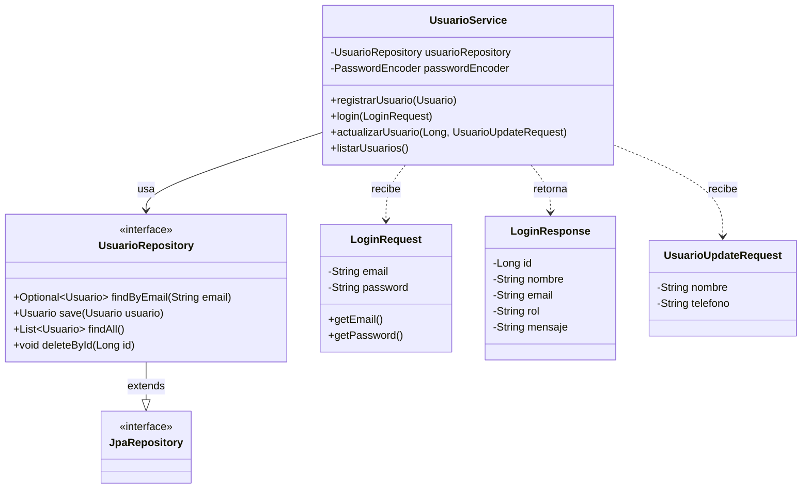
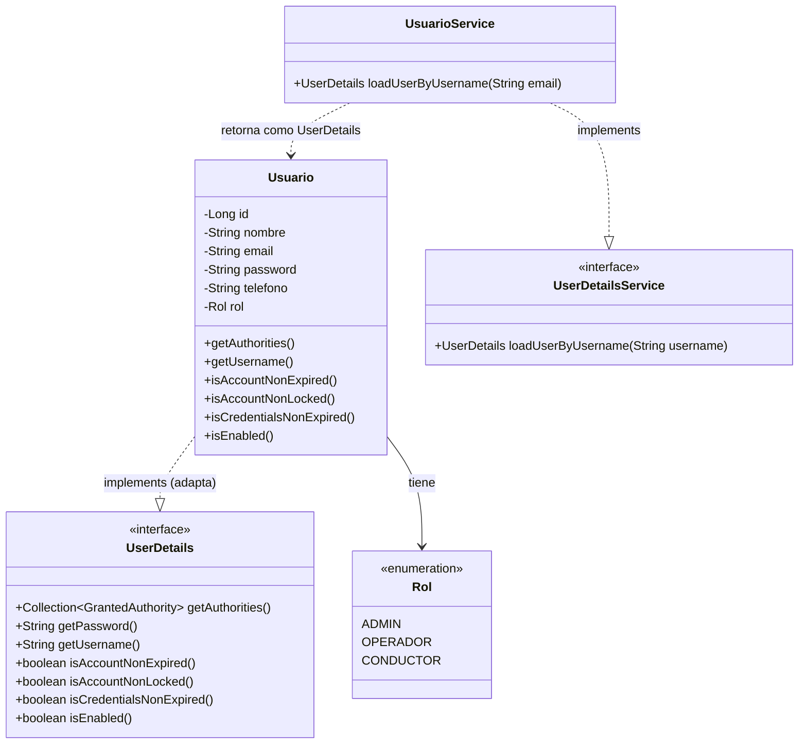
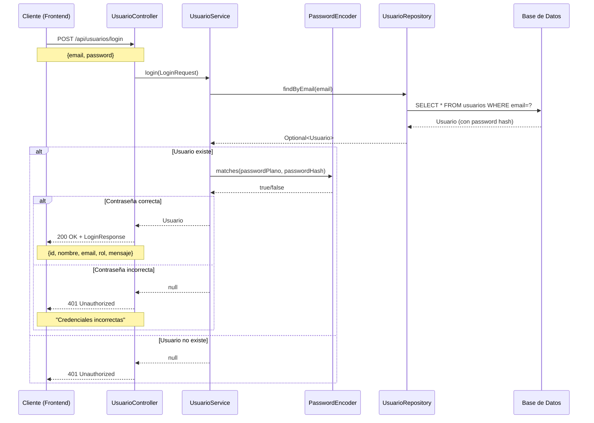

# 📚 DOCUMENTACIÓN - MÓDULO USUARIOS Y AUTENTICACIÓN

**Autor:** Jhonatan  
**Fecha:** Diciembre 2025  
**Tecnología:** Spring Boot 3.2.0 + Java 17 + Spring Security

---

## 📖 ÍNDICE

1. [Resumen Ejecutivo](#resumen)
2. [Arquitectura](#arquitectura)
3. [Patrones de Diseño](#patrones)
4. [Componentes](#componentes)
5. [Endpoints REST](#endpoints)
6. [Sistema de Seguridad](#seguridad)
7. [Validaciones](#validaciones)
8. [Instalación](#instalacion)

---

## 1. RESUMEN EJECUTIVO <a id="resumen"></a>

### 1.1 Alcance del Módulo

- ✅ Registro de Usuarios con encriptación de contraseñas
- ✅ Autenticación (Login) con validación de credenciales
- ✅ Gestión de Roles (ADMIN, OPERADOR, CONDUCTOR)
- ✅ Actualización y Eliminación de Usuarios
- ✅ Integración con Spring Security
- ✅ Encriptación BCrypt para contraseñas

### 1.2 Métricas

| Métrica | Cantidad |
|---------|----------|
| **Endpoints REST** | 5 |
| **Modelos** | 2 (Usuario, Rol) |
| **DTOs** | 3 |
| **Services** | 1 |
| **Controllers** | 1 |
| **Repositories** | 1 |
| **Configuraciones** | 2 (Security, CORS) |
| **Patrones de Diseño** | 5 |

---

## 2. ARQUITECTURA <a id="arquitectura"></a>

### 2.1 Arquitectura en Capas

```
┌─────────────────────────────────────┐
│    PRESENTACIÓN (Controller)        │
│    UsuarioController                │
├─────────────────────────────────────┤
│    APLICACIÓN (DTOs)                │
│    LoginRequest, LoginResponse      │
│    UsuarioUpdateRequest             │
├─────────────────────────────────────┤
│    NEGOCIO (Service)                │
│    UsuarioService                   │
│    + Spring Security Integration    │
├─────────────────────────────────────┤
│    DOMINIO (Models)                 │
│    Usuario (implements UserDetails) │
│    Rol (Enum)                       │
├─────────────────────────────────────┤
│    PERSISTENCIA (Repository)        │
│    UsuarioRepository (JPA)          │
└─────────────────────────────────────┘
```

### 2.2 Estructura de Paquetes

```
com.parking.system/
├── controller/
│   └── UsuarioController.java
├── service/
│   └── UsuarioService.java (implements UserDetailsService)
├── model/
│   ├── Usuario.java (implements UserDetails)
│   └── Rol.java (Enum)
├── dto/
│   ├── LoginRequest.java
│   ├── LoginResponse.java
│   └── UsuarioUpdateRequest.java
├── repository/
│   └── UsuarioRepository.java (JpaRepository)
└── config/
    ├── SecurityConfig.java
    └── CorsConfig.java
```

---

## 3. PATRONES DE DISEÑO <a id="patrones"></a>

### 3.1 Repository Pattern ⭐

**Propósito:** Abstraer el acceso a datos de usuarios.

```java
public interface UsuarioRepository extends JpaRepository<Usuario, Long> {
    Optional<Usuario> findByEmail(String email);
}
```

**Beneficios:**
- ✅ Desacopla lógica de negocio de persistencia
- ✅ Facilita testing (mocks)
- ✅ Aprovecha Spring Data JPA

---

### 3.2 DTO Pattern ⭐

**Propósito:** Separar representación API de modelo de dominio.

```java
// Request (entrada)
public class LoginRequest {
    private String email;
    private String password;
}

// Response (salida)
public class LoginResponse {
    private Long id;
    private String nombre;
    private String email;
    private String rol;
    private String mensaje;
}
```

**Beneficios:**
- ✅ Control sobre datos expuestos (no exponer password)
- ✅ Validación independiente
- ✅ Evolución independiente de API y dominio

---

### 3.3 Service Layer Pattern ⭐

**Propósito:** Centralizar lógica de negocio.

```java
@Service
public class UsuarioService implements UserDetailsService {
    @Autowired
    private UsuarioRepository usuarioRepository;
    
    @Autowired
    private PasswordEncoder passwordEncoder;
    
    public Usuario registrarUsuario(Usuario usuario) {
        usuario.setPassword(passwordEncoder.encode(usuario.getPassword()));
        return usuarioRepository.save(usuario);
    }
}
```

**Beneficios:**
- ✅ Lógica de negocio centralizada
- ✅ Transaccionalidad
- ✅ Reutilización

---

### 3.4 Adapter Pattern (Wrapper) ⭐

**Propósito:** Adaptar el modelo `Usuario` a la interfaz `UserDetails` de Spring Security.

```java
@Entity
public class Usuario implements UserDetails {
    // Campos propios
    private Long id;
    private String nombre;
    private String email;
    private String password;
    private Rol rol;
    
    // Métodos de UserDetails (adaptación)
    @Override
    public Collection<? extends GrantedAuthority> getAuthorities() {
        return List.of(new SimpleGrantedAuthority(rol.name()));
    }
    
    @Override
    public String getUsername() {
        return email; // Adaptamos email como username
    }
    
    @Override
    public boolean isAccountNonExpired() { return true; }
    
    @Override
    public boolean isAccountNonLocked() { return true; }
    
    @Override
    public boolean isCredentialsNonExpired() { return true; }
    
    @Override
    public boolean isEnabled() { return true; }
}
```

**Beneficios:**
- ✅ Integración transparente con Spring Security
- ✅ No requiere clases adicionales
- ✅ Mantiene el modelo de dominio limpio

---

### 3.5 Singleton Pattern

**Implementación:** Gestionado por Spring (Beans).

- `UsuarioService`, `UsuarioController`, `SecurityConfig` son singletons por defecto.

---

## 4. COMPONENTES <a id="componentes"></a>

### 4.1 Modelos

**Usuario**
```java
@Entity
@Table(name = "usuarios")
public class Usuario implements UserDetails {
    @Id
    @GeneratedValue(strategy = GenerationType.IDENTITY)
    private Long id;
    
    @Column(nullable = false)
    private String nombre;
    
    @Column(unique = true, nullable = false)
    private String email;
    
    @Column(nullable = false)
    private String password; // Encriptado con BCrypt
    
    private String telefono;
    
    @Enumerated(EnumType.STRING)
    private Rol rol; // ADMIN, OPERADOR, CONDUCTOR
}
```

**Rol (Enum)**
```java
public enum Rol {
    ADMIN,      // Administrador del sistema
    OPERADOR,   // Operador de estacionamiento
    CONDUCTOR   // Usuario final (conductor)
}
```

---

### 4.2 UsuarioService (Principal)

**Responsabilidades:**
- Registrar usuarios con contraseña encriptada
- Autenticar usuarios (login)
- Actualizar información de usuario
- Eliminar usuarios
- Listar todos los usuarios
- Cargar usuarios para Spring Security (`UserDetailsService`)

**Flujo de Registro:**
```java
public Usuario registrarUsuario(Usuario usuario) {
    // 1. Encriptar contraseña con BCrypt
    usuario.setPassword(passwordEncoder.encode(usuario.getPassword()));
    
    // 2. Guardar en base de datos
    return usuarioRepository.save(usuario);
}
```

**Flujo de Login:**
```java
public Usuario login(LoginRequest loginRequest) {
    // 1. Buscar usuario por email
    Optional<Usuario> usuarioOpt = usuarioRepository.findByEmail(loginRequest.getEmail());
    
    if (usuarioOpt.isPresent()) {
        Usuario usuario = usuarioOpt.get();
        
        // 2. Verificar contraseña con BCrypt
        if (passwordEncoder.matches(loginRequest.getPassword(), usuario.getPassword())) {
            return usuario; // Login exitoso
        }
    }
    return null; // Credenciales incorrectas
}
```

---

### 4.3 SecurityConfig

**Configuración de Seguridad:**
```java
@Configuration
public class SecurityConfig {
    @Bean
    public SecurityFilterChain securityFilterChain(HttpSecurity http) throws Exception {
        http
            .csrf(csrf -> csrf.disable()) // Deshabilitar CSRF para API REST
            .cors(Customizer.withDefaults()) // Habilitar CORS
            .authorizeHttpRequests(auth -> auth
                .anyRequest().permitAll() // Permitir todo (sin autenticación obligatoria)
            )
            .httpBasic(Customizer.withDefaults())
            .headers(headers -> headers.frameOptions(frame -> frame.disable()));
        
        return http.build();
    }
    
    @Bean
    public PasswordEncoder passwordEncoder() {
        return new BCryptPasswordEncoder(); // Encriptación BCrypt
    }
}
```

---

## 5. ENDPOINTS REST <a id="endpoints"></a>

### 5.1 Usuarios (5 endpoints)

| Método | Endpoint | Descripción |
|--------|----------|-------------|
| POST | `/api/usuarios/registrar` | Registrar nuevo usuario |
| POST | `/api/usuarios/login` | Autenticar usuario |
| GET | `/api/usuarios` | Listar todos los usuarios |
| PUT | `/api/usuarios/{id}` | Actualizar usuario |
| DELETE | `/api/usuarios/{id}` | Eliminar usuario |

**Ejemplo Request (Registrar):**
```json
POST /api/usuarios/registrar
{
  "nombre": "Juan Pérez",
  "email": "juan@example.com",
  "password": "miPassword123",
  "telefono": "70123456",
  "rol": "CONDUCTOR"
}
```

**Response:**
```json
{
  "id": 1,
  "nombre": "Juan Pérez",
  "email": "juan@example.com",
  "telefono": "70123456",
  "rol": "CONDUCTOR"
}
```

**Ejemplo Request (Login):**
```json
POST /api/usuarios/login
{
  "email": "juan@example.com",
  "password": "miPassword123"
}
```

**Response (Éxito):**
```json
{
  "id": 1,
  "nombre": "Juan Pérez",
  "email": "juan@example.com",
  "rol": "CONDUCTOR",
  "mensaje": "¡Bienvenido al sistema!!"
}
```

**Response (Error - 401):**
```json
"Credenciales incorrectas"
```

**Ejemplo Request (Actualizar):**
```json
PUT /api/usuarios/1
{
  "nombre": "Juan Carlos Pérez",
  "telefono": "70987654"
}
```

---

## 6. SISTEMA DE SEGURIDAD <a id="seguridad"></a>

### 6.1 Encriptación de Contraseñas

**Algoritmo:** BCrypt (Spring Security)

**Características:**
- Hash unidireccional (no se puede desencriptar)
- Salt automático (cada hash es único)
- Resistente a ataques de fuerza bruta

**Flujo:**
```
Registro:
  Password plano → BCryptPasswordEncoder.encode() → Hash almacenado en BD

Login:
  Password plano + Hash BD → BCryptPasswordEncoder.matches() → true/false
```

### 6.2 Spring Security Integration

**UserDetailsService:**
```java
@Override
public UserDetails loadUserByUsername(String email) throws UsernameNotFoundException {
    return usuarioRepository.findByEmail(email)
        .orElseThrow(() -> new UsernameNotFoundException("Usuario no encontrado"));
}
```

**Roles y Autoridades:**
```java
@Override
public Collection<? extends GrantedAuthority> getAuthorities() {
    return List.of(new SimpleGrantedAuthority(rol.name()));
}
```

---

## 7. VALIDACIONES <a id="validaciones"></a>

| Validación | Regla | Implementación |
|------------|-------|----------------|
| **Email único** | No duplicados | `@Column(unique = true)` |
| **Campos obligatorios** | nombre, email, password | `@Column(nullable = false)` |
| **Contraseña segura** | Encriptada con BCrypt | `PasswordEncoder` |
| **Rol válido** | ADMIN, OPERADOR, CONDUCTOR | `Enum Rol` |

**Validaciones de Login:**
- Email debe existir en BD
- Contraseña debe coincidir con hash almacenado

---

## 8. INSTALACIÓN Y USO <a id="instalacion"></a>

### 8.1 Requisitos
- Java 17+
- Spring Boot 3.2.0
- Spring Security
- Spring Data JPA

### 8.2 Ejecutar
```bash
./mvnw spring-boot:run
```

### 8.3 Probar (cURL)

**Registrar usuario:**
```bash
curl -X POST http://localhost:8080/api/usuarios/registrar \
  -H "Content-Type: application/json" \
  -d '{
    "nombre": "Test User",
    "email": "test@example.com",
    "password": "password123",
    "rol": "CONDUCTOR"
  }'
```

**Login:**
```bash
curl -X POST http://localhost:8080/api/usuarios/login \
  -H "Content-Type: application/json" \
  -d '{
    "email": "test@example.com",
    "password": "password123"
  }'
```

---

## 📊 DIAGRAMAS MERMAID

### Diagrama 1: Patrón Repository y DTO



---

### Diagrama 2: Patrón Adapter (Usuario implements UserDetails)



---

### Diagrama 3: Flujo de Autenticación



---

## 🎯 CONCLUSIÓN

El módulo de Usuarios y Autenticación proporciona una **base sólida y segura** para la gestión de acceso al sistema, utilizando:

- **Spring Security** para autenticación y autorización
- **BCrypt** para encriptación de contraseñas
- **Patrón Repository** para persistencia
- **Patrón DTO** para separación de capas
- **Patrón Adapter** para integración con Spring Security
- **Roles** para control de acceso (ADMIN, OPERADOR, CONDUCTOR)

El diseño es **extensible** y permite agregar fácilmente:
- Autenticación JWT
- Autorización basada en roles (@PreAuthorize)
- Recuperación de contraseña
- Verificación de email
